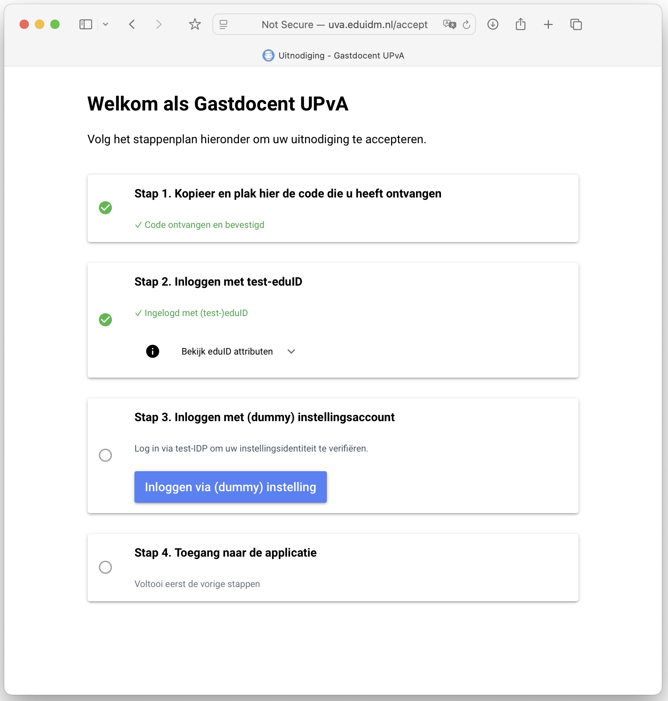

## eduIDM: matching & verificatie van eduID users

Proof of Concept van een self-service pagina om interne accounts te verrijken met eduID-identiteit en -attributen.

Werkwijze (zie ook figuur):

1. Registreer de gebruiker intern (in applicatie en/of IDM/IAM) met een een interne of gast-identifier. 

2. Maak via de API een uitnodiging aan via eduIDM en onthoud de uitnodigingscode.

3. Stuur de code naar de gast, bijvoorbeeld per mail.

4. De gast opent de link naar (of voert de code in op) de self-service-pagina "/accept". Daar leiden we hem/haar door de stappen die nodig zijn om toegang te geven. In deze PoC is het stappenplan grotendeels 'fake'. 

5. eduIDM stuurt het eduID-pseudoniem en -info naar de callback die voor de betreffende groep is geconfigureerd. De applicatie (of IDM/IAM/etc) associeert de eduID met de interne identiteit, en/of vervangt de loginnaam door de eduID EPPN. 

6. Na afronding van het stappenplan tonen we de gast een link naar de applicatie die met de uitnodigingsgroep is geassocieerd, zodat de gast daar direct met eduID kan inloggen.


API:
| endpoint               | verb   |                                                            |
|------------------------|--------|------------------------------------------------------------|
| /api/invitations       | GET    | Ophalen alle uitnodigingen                                 |
| /api/invitations       | POST   | Nieuwe uitnodiging: guest_id & group_name -> invitation_id | 
| /api/groups            | GET    | Ophalen alle groepen (read only op dit moment)             |

Interactief:
| URL                       |                                                                  |
|---------------------------|------------------------------------------------------------------|
| /accept/{invitation_id}   | Start onboarding na ontvangst van invitation_id (per mail bv.)   |
| /invitations              | Bekijk uitnodigingen + interactief aanmaken van nieuwe           |
| /groups                   | Beheer groepen                                                   |

Voor deze PoC wordt de data opgeslagen in (services.storage.) storage.json en kan daar direct worden bewonderd en aangepast. Voor een productie-app ligt een database meer voor de hand.

### Waarom niet eduID Invite

SURF Invite lijkt zich te ontwikkelen tot een RBAC-tool, met als uitgangspunt dat het **volledige** autorisatiepakket voor gasten meegegeven kan worden in rollen -- en dat het dus niet nodig is om de eduID-identiteit te relateren aan een interne identiteit.

Hier kiezen we een ander vertrekpunt, nl. dat het cruciaal is om die relatie tussen interne identiteiten en eduID's wél te kunnen leggen. Behalve deze matching van identiteiten zorgt de self-service pagina ervoor dat de externe *gebruiker* een goede 'onboarding' ervaring heeft en dat de *instelling* zekerheid heeft wie er inlogt.  



### Installatie

```
mkdir eduidm && cd $_
git clone https://github.com/kleynjan/eduIDM.git .
conda create -n eduidm python=3
conda activate eduidm
pip install -r requirements.txt
cp config.json.org config.json
```

Maak in je SP Dashboard een OIDC RP client endpoint aan en kopieer deze gegevens naar `config.json`. Pas ook de REDIRECT_URI aan.

Start de applicatie met `python main.py` en ga met je browser naar `http://localhost:8085/`

### TODO
* POST terug naar de backend (al dan niet met SCIM). 
* POST naar backend in aparte task onderbrengen i.v.m. retries.
* Verzenden van uitnodiging per mail. 
* Redirect/initiëren van tweede factor.
* Allerlei denkbare verificaties (tweede login bij instelling, iDIN, affiliatie)
* Styling via SCSS i.p.v. random Tailwind noise

### License
This project is licensed under the GNU Affero General Public License (AGPL) version 3. 

